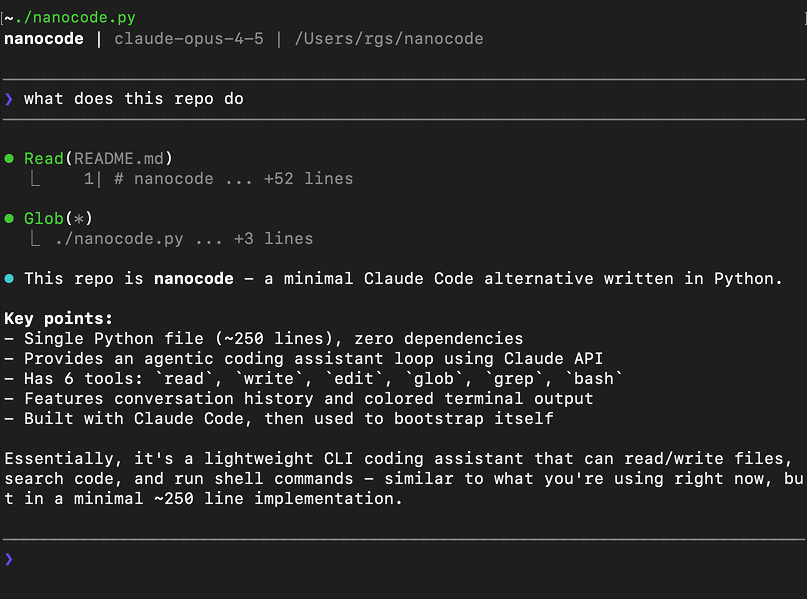

# nunnuncode

[🇬🇧 English](README.md) · [🇻🇳 Tiếng Việt](README_VI.md) · [🇩🇪 Deutsch](README_DE.md)

> Dự án cá nhân để tự học về cách coding agent hoạt động — bắt đầu từ việc đọc code, rồi tự viết lại từ đầu.

Micro Coding Agent. Một file Python duy nhất, zero dependencies, ~250 dòng.



## Tại sao có dự án này

Đây là sân chơi tự học của tôi về **coding agent tự phát triển**. Tôi bắt đầu bằng việc nghiên cứu cách một agent loop tối giản hoạt động — LLM + tools + history — rồi xây lại từng dòng để thực sự hiểu nó. Không framework, không phụ thuộc, chỉ có các cơ chế cốt lõi.

## Tính năng

- Agent loop đầy đủ với tool use
- Tools: `read`, `write`, `edit`, `glob`, `grep`, `bash`
- Lịch sử hội thoại
- Output màu trên terminal
- Một file duy nhất, zero dependencies

## Cách sử dụng

```bash
export ANTHROPIC_API_KEY="your-key"
python nanocode.py
```

### OpenRouter

Dùng [OpenRouter](https://openrouter.ai) để truy cập mọi model:

```bash
export OPENROUTER_API_KEY="your-key"
python nanocode.py
```

Để dùng model khác:

```bash
export OPENROUTER_API_KEY="your-key"
export MODEL="openai/gpt-5.2"
python nanocode.py
```

### Provider OpenAI-compatible tùy ý

Chạy được với mọi endpoint OpenAI-compatible (LLM gateway của công ty, Ollama, vLLM, LM Studio, ...):

```bash
export API_BASE_URL="https://api.siemens.com/llm/v1"
export API_KEY="your-key"
export MODEL="your-model-name"
python nanocode.py
```

- `API_BASE_URL` — base URL tính đến `/v1`; nanocode tự thêm `/chat/completions`
- `API_KEY` — gửi dưới dạng `Authorization: Bearer` (bỏ qua với server local không cần auth)
- `MODEL` — bắt buộc khi dùng `API_BASE_URL`

### Chạy test

```bash
python -m unittest discover tests
```

## Lệnh

| Lệnh | Mô tả |
|------|-------|
| `/c` | Xóa hội thoại |
| `/q` hoặc `exit` | Thoát |

## Công cụ

| Tool | Mô tả |
|------|-------|
| `read` | Đọc file kèm số dòng, offset/limit |
| `write` | Ghi nội dung vào file |
| `edit` | Thay chuỗi trong file (phải duy nhất) |
| `glob` | Tìm file theo mẫu, sắp xếp theo mtime |
| `grep` | Tìm regex trong files |
| `bash` | Chạy lệnh shell |

## Ví dụ

```
────────────────────────────────────────
❯ what files are here?
────────────────────────────────────────

⏺ Glob(**/*.py)
  ⎿  nanocode.py

⏺ There's one Python file: nanocode.py
```

## Ghi chú học tập

Những gì tôi học được khi xây dự án này:

- **Agent loop chỉ là một vòng lặp while**: gửi tin nhắn → LLM trả lời bằng tool calls → chạy tools → gửi kết quả lại → lặp lại cho đến khi không còn tool call.
- **Tool chỉ là JSON schema + hàm Python**: LLM không bao giờ "thấy" code, chỉ thấy schema.
- **Thiết kế ràng buộc quan trọng hơn chọn model**: bắt `edit` phải khớp duy nhất giúp tránh hầu hết lỗi hỏng file.

## Định hướng

- [ ] Custom API base URL (mọi provider Anthropic-compatible)
- [x] Hỗ trợ provider OpenAI-compatible
- [ ] Lưu hội thoại
- [ ] Tool web fetch

## Lời cảm ơn

Dựa trên [nanocode](https://github.com/1rgs/nanocode) của [1rgs](https://github.com/1rgs).

## Giấy phép

MIT
